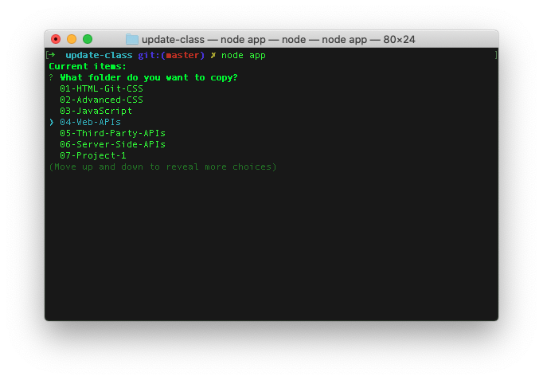
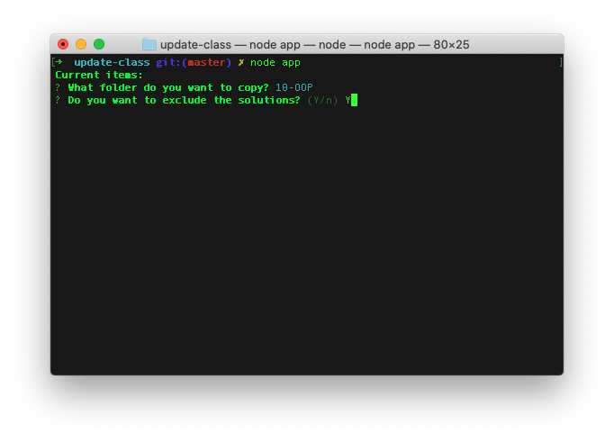
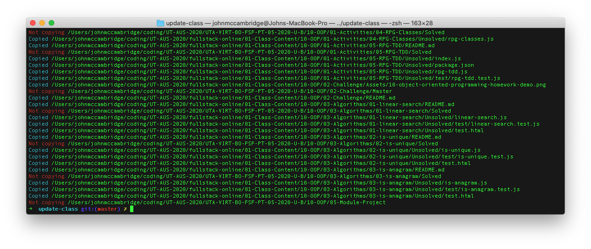

# Update-Class 📋

This is a small CLI utility to copy the (not solved) content from your fullstack online repo to the class repo

Make sure to modify your fullstack-online and class repo PATH in the variables found in `classrepo.js`

